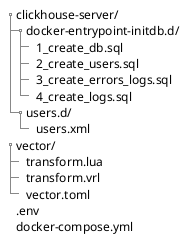
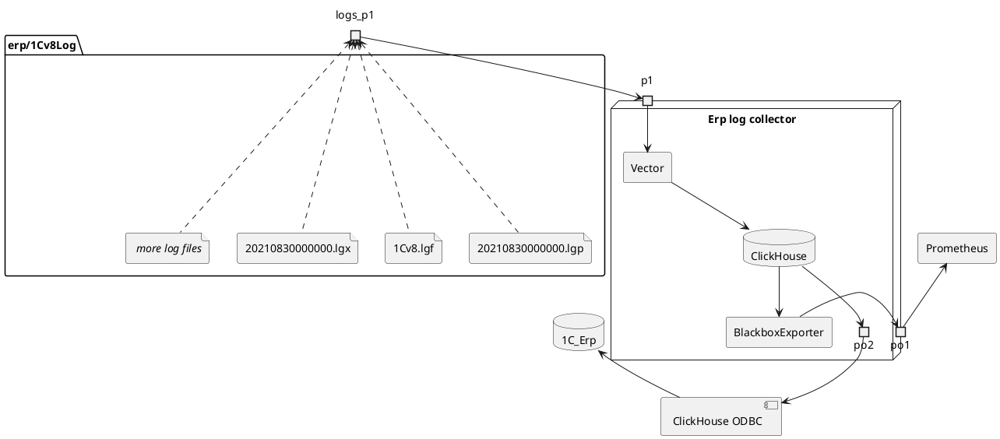

# Функционал
Перекладываем логи из файлов в БД Clickhouse, с возможностью подключения к 1с с помощью ODBC- коннектора.

# Необходимое ПО

## Для загрузки журналов регистрации
- [docker](https://www.docker.com/products/docker-desktop/)
## Для подключения 1С к базе
- [odbc-connector](https://github.com/ClickHouse/clickhouse-odbc/releases)
# Необходимый доступ 
Необходимо предоставить доступ к каталогам хранения логов на серверах 1с

# Запуск приложения
- Настройки приложения прописываем в файле .env *(более подробное описание настроек в разделе **Описание проекта** )
- В консоли (cmd/PowerShell) последовательно выполняем 
```cmd
cd <Каталог проекта>
docker compose -f "docker-compose.yml" up -d --build 
```
# Описание проекта
## Состав проекта



## clickhouse-server
Используется для хранения параметров ClickHouse сервера
### docker-entrypoint-initdb.d
Используется для хранения скриптов, которые будут запущены после старта сервера. Выполняются по очереди.

`1_create_db.sql` - создаёт БД, если не существует

`2_create_users.sql` - создаёт пользователей и выдает права

`3_create_errors_logs.sql`  - создаёт таблицу для хранения ошибок трансформации


### users.d
Используется для хранения настроек пользователей

`users.xml` - первоначальные настройки пользователей, которые будут скопированы во время запуска сервера СУБД

## vector
### config
Конфигурационный файл
#### vector.toml
Файл настроек Vector,  используется при запуске Vector. Определяет механизм трансформации, входные потоки и выходные.

#### transform.vrl
Отвечает за базовую трансформацию логов:

#### transform.lua
Файл трансформации логов, отвечает за второстепенную обработку логов и ремап.

## Docker-compose.yml

- Запускает СУБД Clickhouse, создаёт БД, пользователей и таблицы для записи логов
- Запускает ITL систему VECTOR, которая трансформирует файлы с доступного каталога в записи БД Clickhouse

## .env

```ad-info
Секция **LOCAL VAR** содержит поля, которые нужно менять при запуске нескольких экземлпяров приложения
```
# Схема работы




# backlinks
[[2023-01-27]]
# links
[Выгрузка журнала регистрации 1С в ClickHouse с помощью Vector](https://foru
m.infostart.ru/forum86/topic289818/)
[Собираем систему потоковой аналитики из логов приложений](https://habr.com/ru/post/697970/)
[monitoring-by-logs](https://github.com/axilab/monitoring-by-logs)
[Использование Clickhouse для работы с журналом регистрации](https://infostart.ru/public/1597740/)
[Разбор технологического журнала без боли и страданий](https://infostart.ru/public/1773131/)
# tags
#ЖурналРегистрации #vector #1c 